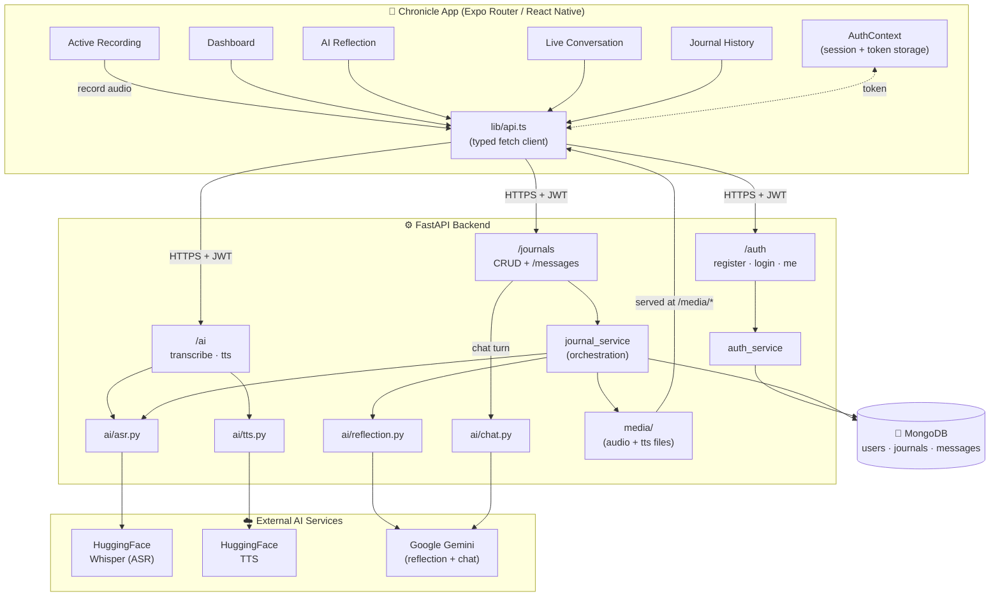
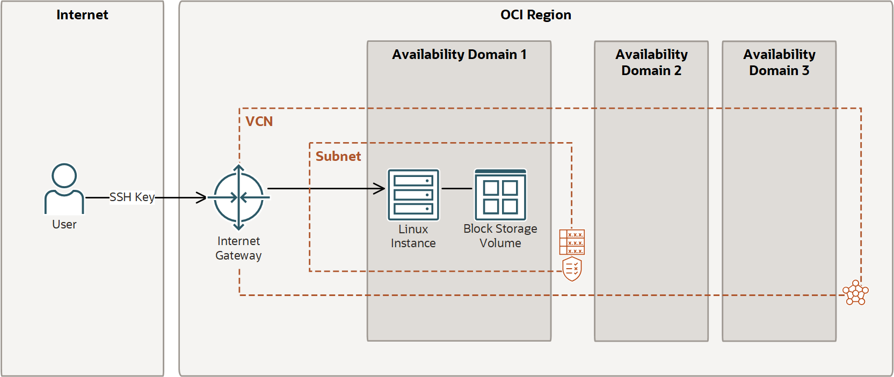

# Chronicle

Chronicle is an AI-powered voice journaling app. Speak your entry, and Chronicle transcribes
it, reflects back on it with a CBT-informed AI companion, and lets you keep talking about it
— all saved to your personal journal history.

- **Frontend:** React Native (Expo Router) — iOS, Android, and web
- **Backend:** FastAPI (Python), MongoDB
- **AI:** Whisper (speech-to-text) + Gemini (reflection & chat) + HuggingFace TTS

---

## How it works

1. **Record.** Tap the mic on the dashboard, pick a mood, speak.
2. **Reflect.** The recording is transcribed and Chronicle generates a short, warm reflection
   on what you said — surfaced as its own screen with a "listen to response" option.
3. **Continue the conversation.** Keep talking to Chronicle about the entry in a live chat,
   by voice or text.
4. **Look back.** Every entry and conversation is saved and searchable in your journal history.

---

## Project structure

```
chronicle/
├── backend/                 FastAPI + MongoDB API
│   ├── app/
│   │   ├── core/            settings, JWT auth, shared dependencies
│   │   ├── db/               MongoDB connection + indexes
│   │   ├── models/           Mongo document schemas (User, Journal, Message)
│   │   ├── schemas/          API request/response schemas
│   │   ├── routes/           auth, journals, ai, health
│   │   ├── services/
│   │   │   ├── ai/           Whisper (ASR), Gemini (reflection/chat), TTS
│   │   │   ├── journal_service.py   orchestrates record → transcribe → reflect → save
│   │   │   └── media.py      on-disk audio storage helpers
│   │   └── main.py
│   ├── tests/                pytest suite (fake Mongo + fake AI, no external services needed)
│   ├── media/                 recorded + generated audio (gitignored)
│   ├── requirements.txt
│   └── .env.example
│
└── application/               Expo Router app
    ├── app/                    screens (dashboard, recording, reflection, chat, history…)
    ├── components/chronicle/   shared UI (bottom nav, etc.)
    ├── context/auth-context.tsx  session state, token persistence
    ├── lib/api.ts               typed API client shared by every screen
    └── .env.example
```

---

## Architecture



**Request flow for recording an entry:**
`ActiveRecording` records audio on-device → uploads it to `POST /journals` → the backend
saves the audio, transcribes it (Whisper), generates a structured reflection (Gemini), stores
everything in MongoDB (`journals` + a seeded `messages` entry), and returns the full entry in
one response → the app navigates straight to `AiReflection` with real data.

---

## Prerequisites

- Python 3.11+
- Node.js 20+
- A MongoDB database (Atlas free tier or local `mongod`)
- API keys (free tiers available):
  - [HuggingFace token](https://huggingface.co/settings/tokens) — speech-to-text & text-to-speech
  - [Google Gemini API key](https://aistudio.google.com/apikey) — AI reflection & chat

The app works without the AI keys too — auth, recording, and history all function; you'll
just get a friendly error instead of a reflection until the keys are set.

---

## Backend setup

```bash
cd backend
python -m venv venv
source venv/bin/activate        # Windows: venv\Scripts\activate
pip install -r requirements.txt

cp .env.example .env
# then edit .env: set MONGODB_URL, JWT_SECRET_KEY, HUGGINGFACE_API_KEY, LLM_API_KEY

uvicorn app.main:app --reload --host 0.0.0.0 --port 8000
```

The API is now at `http://localhost:8000` (docs at `/docs`). Check `GET /api/v1/health` to
confirm MongoDB and the AI keys are configured correctly.

**Run the tests** (no live MongoDB or API keys required — everything is faked):

```bash
pip install -r requirements-dev.txt
pytest
```

---

## Frontend setup

```bash
cd application
npm install

cp .env.example .env
# edit .env: set EXPO_PUBLIC_API_URL to point at your backend (see note below)

npx expo start
```

Then press `i` (iOS simulator), `a` (Android emulator), or `w` (web), or scan the QR code
with Expo Go on a physical device.

**Setting `EXPO_PUBLIC_API_URL`:**
| Running on | Use |
|---|---|
| Web / iOS simulator | `http://localhost:8000/api/v1` |
| Android emulator | `http://10.0.2.2:8000/api/v1` |
| Physical device | `http://<your-server's-public-IP>:8000/api/v1` |

---

## Production Deployment (Oracle Cloud)

This guide covers deploying the Chronicle backend to a production server. The instructions
are written for Oracle Cloud's Free Tier (Always Free) but can be adapted to any Linux VPS.

### Server Requirements

| Resource | Specification |
|---|---|
| Provider | Oracle Cloud Free Tier / Always Free (or any VPS) |
| Shape | VM.Standard.A1.Flex (ARM64) or equivalent |
| OCPUs | 2 (minimum for AI model inference) |
| RAM | 12 GB (minimum for Whisper + TTS models) |
| Storage | 200 GB block storage (Always Free allowance) |
| OS | Oracle Linux 9 (or Ubuntu 22.04+) |

### 1. Oracle Cloud Console Setup

1. **Create a compartment** for resource organization
2. **Create a VCN** (Virtual Cloud Network) with a public subnet
3. **Configure Security List** — open the following ports:
   - TCP 22 (SSH)
   - TCP 8000 (FastAPI)
4. **Create the instance:**
   - Image: Oracle-Linux-9.x (or your preferred distro)
   - Shape: VM.Standard.A1.Flex (2 OCPU, 12 GB RAM)
   - Boot volume: ~50 GB (within free tier limits)
   - SSH key: upload your public key (`.pub` file)
5. **Note the public IP address** assigned to the instance



### 2. Initial Server Setup

SSH into your instance using the `opc` user (default for Oracle Linux):

```bash
ssh -i /path/to/your/private-key.pem opc@<your-server-public-ip>
```

Update the system and install essential packages:

```bash
sudo dnf update -y
sudo dnf install -y git python3.12 python3.12-devel python3.12-pip
```

### 3. Python Setup

Chronicle requires Python 3.12+ for optimal AI model support. Create a virtual environment
with the newer Python version:

```bash
# Verify Python version
python3.12 --version

# Navigate to the application directory
cd ~/Chronicle-Application/backend

# Create virtual environment with Python 3.12
python3.12 -m venv .venv

# Activate the virtual environment
source .venv/bin/activate

# Install dependencies
pip install --upgrade pip
pip install -r requirements.txt
```

### 4. FFmpeg Installation

Oracle Linux repositories may not include FFmpeg. Install it manually:

```bash
# Download static FFmpeg build for ARM64 (or x86_64 if using Intel)
cd /tmp
curl -LO https://github.com/BtbN/FFmpeg-Builds/releases/download/latest/ffmpeg-master-latest-linuxarm64-gpl.tar.xz
tar -xf ffmpeg-master-latest-linuxarm64-gpl.tar.xz
sudo cp ffmpeg-master-latest-linuxarm64-gpl/bin/ffmpeg /usr/local/bin/
sudo cp ffmpeg-master-latest-linuxarm64-gpl/bin/ffprobe /usr/local/bin/
rm -rf ffmpeg-master-latest-linuxarm64-gpl*

# Verify installation
ffmpeg -version
ffprobe -version
```

### 5. Environment Configuration

On your local machine, ensure your SSH key is in the repository root:

```bash
# Your SSH key for Oracle Cloud
ls *.key *.pem 2>/dev/null || ls ~/.ssh/id_* 2>/dev/null
```

Clone/pull the repository on the server:

```bash
cd ~/Chronicle-Application
git pull origin main
```

Create the `.env` file with production values:

```bash
cd ~/Chronicle-Application/backend
nano .env
```

Required variables:
```
MONGODB_URL=mongodb+srv://<user>:<password>@<cluster>/chronicle
JWT_SECRET_KEY=<generate-with-openssl-rand-hex-32>
HUGGINGFACE_API_KEY=your-huggingface-token
LLM_API_KEY=your-gemini-api-key
CORS_ORIGINS=https://your-frontend-domain.com,http://localhost:3000
```

### 6. Firewall Configuration

Open port 8000 in the server firewall:

```bash
sudo firewall-cmd --permanent --add-port=8000/tcp
sudo firewall-cmd --reload

# Verify
sudo firewall-cmd --list-ports
```

### 7. Systemd Service Setup

Create a systemd service for automatic startup and crash recovery:

```bash
sudo nano /etc/systemd/system/chronicle.service
```

Paste the following configuration:

```ini
[Unit]
Description=Chronicle FastAPI Backend
After=network.target

[Service]
User=opc
Group=opc
WorkingDirectory=/home/opc/Chronicle-Application/backend
EnvironmentFile=/home/opc/Chronicle-Application/backend/.env
ExecStart=/home/opc/Chronicle-Application/backend/.venv/bin/uvicorn app.main:app --host 0.0.0.0 --port 8000
Restart=always
RestartSec=5

[Install]
WantedBy=multi-user.target
```

Enable and start the service:

```bash
sudo systemctl daemon-reload
sudo systemctl enable chronicle
sudo systemctl start chronicle

# Check status
sudo systemctl status chronicle
```

### 8. SELinux Considerations (Oracle Linux)

If running with SELinux Enforcing, you may need to set the correct security context:

```bash
# Allow systemd to execute binaries in the virtual environment
sudo chcon -R -t bin_t /home/opc/Chronicle-Application/backend/.venv

# Set context for .env file
sudo chcon -t etc_t /home/opc/Chronicle-Application/backend/.env
```

### 9. Managing the Service

```bash
# Check status
sudo systemctl status chronicle

# View logs (follow mode)
sudo journalctl -u chronicle -f

# View last 100 lines
sudo journalctl -u chronicle -n 100 --no-pager

# Restart (after code updates)
sudo systemctl restart chronicle

# Stop / Start
sudo systemctl stop chronicle
sudo systemctl start chronicle
```

### 10. Git-Based Deployment Workflow

**Local development machine:**

```bash
# After making changes
git add .
git commit -m "Description of changes"
git push origin main
```

**On the server:**

```bash
cd ~/Chronicle-Application
git pull origin main

# If Python dependencies changed
source .venv/bin/activate
pip install -r requirements.txt

# Restart the service
sudo systemctl restart chronicle
```

### 11. Updating the Frontend API URL

After deployment, update your app's environment to point to the production server:

```bash
# In application/.env
EXPO_PUBLIC_API_URL=http://<your-server-public-ip>:8000/api/v1
```

For production, consider:
- Using HTTPS with a reverse proxy (nginx + certbot)
- Pointing a domain name to your server
- Updating `CORS_ORIGINS` to match your frontend domain

### 12. Troubleshooting

**Service won't start:**
```bash
# Check logs
sudo journalctl -u chronicle -n 50 --no-pager

# Verify .env exists and has correct permissions
ls -la /home/opc/Chronicle-Application/backend/.env
```

**Model inference errors:**
```bash
# Verify venv Python packages
source .venv/bin/activate
pip list | grep -E "torch|transformers|huggingface"

# Test FFmpeg
ffmpeg -version
```

**Port 8000 not accessible:**
```bash
# Check if FastAPI is listening
sudo netstat -tlnp | grep 8000

# Check firewall
sudo firewall-cmd --list-all
```

---

## Environment variables

### `backend/.env`
| Variable | Required | Description |
|---|---|---|
| `MONGODB_URL` | ✅ | MongoDB connection string |
| `JWT_SECRET_KEY` | ✅ | Secret for signing auth tokens (`openssl rand -hex 32`) |
| `HUGGINGFACE_API_KEY` | for AI | Powers speech-to-text and text-to-speech |
| `LLM_API_KEY` | for AI | Gemini key, powers reflection + chat |
| `GOOGLE_CLIENT_ID` / `GOOGLE_CLIENT_SECRET` | optional | Enables "Sign in with Google" |
| `CORS_ORIGINS` | optional | Comma-separated allowed origins (default `*`) |

See `backend/.env.example` for the full list with defaults.

### `application/.env`
| Variable | Required | Description |
|---|---|---|
| `EXPO_PUBLIC_API_URL` | ✅ | Base URL of the backend API, including `/api/v1` |

---

## API overview

All endpoints except `/auth/register` and `/auth/login` require `Authorization: Bearer <token>`.

| Method | Path | Description |
|---|---|---|
| POST | `/api/v1/auth/register` | Create an account |
| POST | `/api/v1/auth/login` | Get an access token |
| GET | `/api/v1/auth/me` | Current user profile |
| POST | `/api/v1/journals` | Upload audio → transcribe → reflect → save (multipart) |
| GET | `/api/v1/journals` | List entries (summaries) |
| GET | `/api/v1/journals/{id}` | Full entry incl. transcript + reflection |
| PATCH | `/api/v1/journals/{id}` | Update title/mood |
| DELETE | `/api/v1/journals/{id}` | Delete an entry and its conversation |
| GET | `/api/v1/journals/{id}/messages` | Conversation history for an entry |
| POST | `/api/v1/journals/{id}/messages` | Send a message, get the AI's reply |
| POST | `/api/v1/ai/transcribe` | Standalone transcription (used by the chat mic) |
| POST | `/api/v1/ai/tts` | Text-to-speech, returns a media URL |
| GET | `/api/v1/health` | Service status (Mongo + AI config) |

Full interactive docs at `http://localhost:8000/docs` once the backend is running.

---

## Data model (MongoDB)

- **`users`** — email, hashed password, profile
- **`journals`** — one per recorded entry: transcript, mood, audio path, AI reflection,
  status (`processing` / `ready` / `failed`)
- **`messages`** — every conversation turn (the initial reflection is seeded as the first
  assistant message, so `AiReflection` and the live chat screen share one source of truth)

---

## Security note

This repository's `backend/.env` previously contained **live, working credentials**
(a MongoDB Atlas password and a JWT signing secret), and `opencode.json` contained a live
OpenRouter API key. Those secrets have been redacted/replaced with placeholders in this
delivery, but **if these values were ever committed to a real git history or shared
elsewhere, rotate them immediately** — treat them as compromised. Going forward, `.env` is
gitignored at the repo root; only commit `.env.example` files.

---

## Known limitations (MVP scope)

- Audio is stored on local disk (`backend/media/`), not object storage — fine for a single
  backend instance, but won't survive a redeploy on most PaaS platforms. Swap `app/services/media.py`
  for an S3-backed implementation for real production use.
- Only Gemini is wired up as an LLM provider; `app/services/ai/client.py` is the single seam
  to add others.
- "Insights" (mood trends over time) is stubbed as "coming soon" in the bottom nav — the data
  (`mood` + `created_at` per entry) is already there for a future dashboard.
- Google Sign-In is implemented server-side but has no button wired up in the app yet (needs
  a native Google client ID to configure `expo-auth-session` on the frontend).
